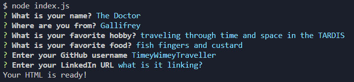

# node-inquirer-html-about-me-
> Module 9 Mini Project Node.js: HTML generator

This is a node command line tool that generates an html about me page based on user imput. Using Node.js and the [inquirer NPM](https://www.npmjs.com/package/inquirer/v/9.2.8) package to capture user input through the command line interface and generate a personalized About Me page in HTML.<br><br>


## ScreenCaptures
<br><br>
[SAMPLE of a generated page ➡️](https://github.com/CypherNyx/node-inquirer-html-about-me-/blob/main/assets/SAMPLE-about-me.html)
<br><br>




## Installation
To use this tool, you'll need to have Node.js installed on your computer. Once you have Node.js set up, you can follow these steps to install and use the application:

1. Clone this GitHub repository to your local machine. <br> 
```sh
git clone git@github.com:CypherNyx/node-inquirer-html-about-me-.git
```
2. Open a terminal or command prompt and navigate to the cloned repository's directory.
3. Run ```npm install``` to install the necessary dependencies.

## Usage
To generate a professional "About Me" html page, follow these steps:

1. Open a terminal or command prompt and navigate to the parent directory.
2. Run the application using the command <br>
```sh
node index.js
```
3. Answer the prompted questions about your application repository.
4. Once you have provided all the required information, the application will generate a file named about-me.html in the same directory with the appropriate sections and content.

## License
[](https://opensource.org/licenses/MIT)
  
  https://opensource.org/licenses/MIT 

## Questions
If you have any questions or need further assistance, you can reach me via the following:

  GitHub: [Dahlia Guido's GitHub](https://github.com/CypherNyx) <br>
  Email: dguido.dev@gmail.com
  